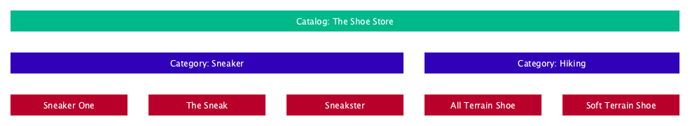
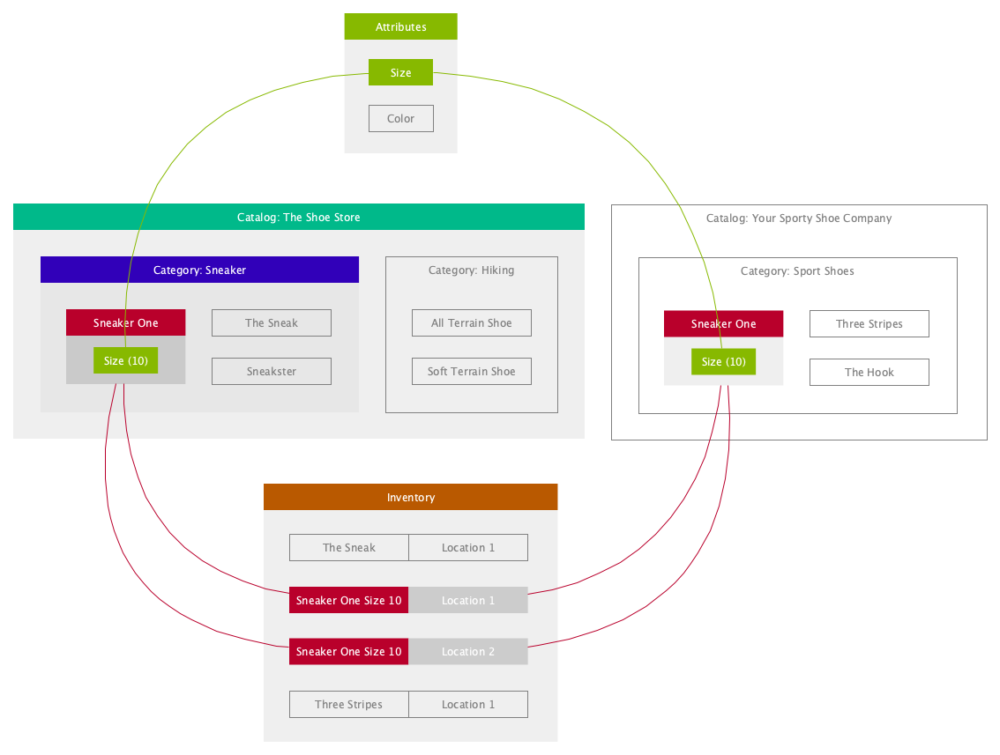

# Concepts and Entities

## Content

1. [Main Entities](#main-entities)
2. [Entity Relationships](#entity-relationships)
3. [Inventory handling for direct ship and in store availability](#inventory-handling-for-direct-ship-and-in-store-availability)
4. Product
   1. [Variants and Attributes](#product-variants-and-attributes)
   2. [Properties](#product-properties)
   3. [Status](#product-status)
   4. [Unit Price Information](#unit-price-information)
5. [Entity Localization](#entity-localization)

## Main Entities

This document covers the main entities as well as concepts of the Catalog API.

### Catalog

The Catalog is basically a container for Products and Categories. It has general information like the default currency and default locale of the Products and Categories inside.

### Attribute

Attributes can be tied to Products to extend their representation. Attribues are not tied to a catalog but general entites of a merchant. This means they can be shared between products of multiple catalogs.

### Category

A Category is a container of other categories or products. Categories hold information like their path in the category tree, name, description, image in a multi locale way.

### Product

This is a representation of a product. It holds information like it's price, description, media, status, availibility, options and extras, units and shipment.

Products have three different model types:

- **standard**: a standalone product
- **configurable**: a parent product of multiple variants with all the extras and options
- **variant**: a variant of a configurable product determind by a unique options and extras combination

see [Product Variants and Attributes](#product-variants-and-attributes)

### Inventory

The product stock information can be managed by the inventory entity. Via this entity you can specify how many products are present in a single location by sku, bin and binLocation.

# Concepts

The following part covers important concepts of the Catalog API.

## Entity Relationships

Some entities are arranged in a tree-like structure. Product Attributes, and Inventory are independent entities. Products and Categories are tied to a catalog and cannot be shared between Catalogs. If there are the same Products or Categories in multiple Catalogs, these entities must be created for each Catalog separately.



Attributes and Inventory however are independent of catalogs and directly tied to the merchant. For example inventory are shared between all catalog products. If catalog A product X is out of stock catalog B product X is also out of stock.



## Inventory handling for direct ship and in store availability

The product entity itself does not contain inventory information, only the field isInventoryManaged to define if inventory is managed for this product at all. isInventoryManaged false means the product is orderable in infinite quantities. isInventoryManaged true means the product is only orderable if inventory entries exist for this product with sufficient quantities.

An inventory record always contains the product code and the location code. One product can have multiple inventory entries, even for the same location (for example if the same product is stored in the same location in two different bins).

For in store availability (used for “buy online pickup in store” or “reserve online pickup in store”), the location code of the specific store has to be set.

Direct ship availability is handled the same way. You need to have one location of type “warehouse” and isDefault set to true. This location is then treated as the default warehouse and “direct ship inventory” location. To specify that a product is available in quantity x for direct ship orders, create an inventory record and assign it to this default warehouse location.

## Product Variants and Attributes

Attributes are characteristics of products which is choosable by the customer.
There are different types of attributes:

- Text
- Input
- ProductList
- Number

One attribute can also have fixed values which are selectable by the shopper.
The best examples for attributes with values are color and size.
The merchants can predefine every value for instance red, green, blue or XS, S, M, L.
These values are called `Attribute values`.
Furthermore swatches can be assigned to every value to provide a better shopper experience.
Swatches can have the following values:

- Image url
- Hex code to a color

> Attributes and attribute values are independent from products and attached to the merchant.

The connection between product and extras are product options (selection mandatory) or product extras (selection is optional).
Those connections are products that have attributes and attribute values assigned.

### Example for Product Options

Let's assume a store offers a T-Shirt in the color red, yellow and green. The sizes are S, M and L.

So the variant/child product with the size L and the color red will get the following product option data set:

| Product Code | Attribute Code | Attribute Value Code |
| ------------ | -------------- | -------------------- |
| 24-L-RED     | size           | L                    |
| 24-L-RED     | color          | red                  |

The configurable/parent product should have the following product option data set:

| Product Code | Attribute Code | Attribute Value Code |
| ------------ | -------------- | -------------------- |
| 24-L-RED     | size           | L                    |
| 24-L-RED     | size           | M                    |
| 24-L-RED     | size           | S                    |
| 24-L-RED     | color          | red                  |
| 24-L-RED     | color          | yellow               |
| 24-L-RED     | color          | green                |

> The configurable product should always have the complete mapping of attribute values which are available as a variant (child).

## Product Properties

Product Properties have the main purpose to add additional information to a product such as upselling product lists, ties to attributes that are not used as options, and others.

The retail.red system supports different types of properties each with a slightly different struture:

- **`simple`**: simple property key value pair like: style -> italic

  ```json
  {
  	"code": "grown_in",
  	"name": {
  		"en-us": "Grown in"
  	},
  	"type": "simple",
  	"value": {
  		"en-us": "Austria"
  	},
  	"displayGroup": "properties"
  }
  ```

- **`attribute`**: maps an attribute and its values to a product property. In this case the property code is the attribute code and the property value is a liste of attribute value codes. The references to the attribute and its values get resolved (with the correct locale) when getting the product.

  ```json
  // In create or update method
  {
  	"code": "size", // Attribute code
  	"type": "attribute",
  	"value": ["small", "big"], // Attribute value codes
  	"displayGroup": "properties"
  }
  ```

  resolves to:

  ```json
  // In get response body
  {
  	"code": "size",
  	"name": "Größe", // From attribute.name in locale de-de
  	"type": "attribute",
  	"value": ["klein", "groß"], // From attributeValue.name
  	"displayGroup": "properties"
  }
  ```

- **`product`**: in this case the value is a single product code

- **`productList`**: the value is an array of product codes

## Product Status

There are two different properties determining the products status. The `status` property is a mutable property that can be set either `active` or `inactive`.

The `operationStatus` is a property that is of more informational use for a customer. It is not setable but computed by the influence of other properties.

The rules of the computation are:

`operationalStatus` is

- **`inactive`** if `status` has been set to `inactive`
- **`scheduled`** if `status` is not `inactive`, `startDate` is in the future
- **`expired`** if `status` is not `inactive`, `endDate` is in the past
- **`active`** if `status` is not `inactive`, `startDate` and `endDate` have not been set, or product is within time range

## Unit Price Information

For metric units, the retail.red system is able to show prices per unit like 1,50€/kg. The unit price of a product is the base price per measurement unit. For example for a 600g pack of cereals, the unit price of this product would be the price per 1kg.

In order to be displayed, all of the related fields on the product data need to be set. If any one of these fields is not set, the unit price will not be displayed for this product.
There are 4 relevant fields:

| FieldName         | Description                                     | Example |
| ----------------- | ----------------------------------------------- | ------- |
| Unit              | The unit that the product is measured in        | g       |
| UnitValue         | How much of this unit the product contains      | 600     |
| UnitPriceRefUom   | The unit that should be used for the unit price | kg      |
| UnitPriceRefValue | Quantity measurement of the unit price          | 1       |

Here are some example products and how the different fields would be set:

| Product                      | Unit  | UnitValue | UnitPriceRefUom | UnitPriceRefValue |
| ---------------------------- | ----- | --------- | --------------- | ----------------- |
| Aspirin pills, pack of 80    | piece | 80        | piece           | 1                 |
| Cereals, 600g pack           | g     | 600       | kg              | 1                 |
| Chocolate Pralines, 75g pack | g     | 75        | g               | 100               |
| 1.5kg Bag of Apples          | kg    | 1.5       | kg              | 1                 |

## Entity Localization

Models of GET and POST Methods are not completely the same on some Routes. Localized properties differ on those routes.

Requests for entities will always return the entity in a certain language. If no specific locale has been provided, the catalogs default locale will be used. An entity with in a specific language can be requested by using the `locale` query paramter.

POST Method

```json
"name": {
	"en-us": "name 1",
	"de-de": "Name 1"
}
```

GET Representation (with ?locale=de-de) resolves to:

```json
"name": "Name 1"
```

> **Note:** There are properties where the localization value is not only a string but an object (see product media)
