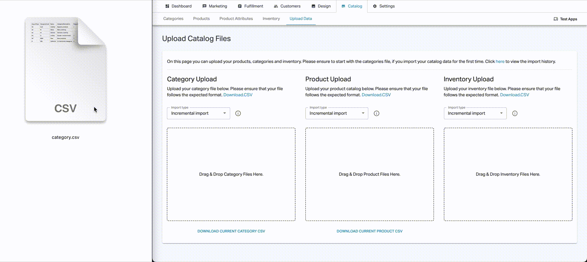
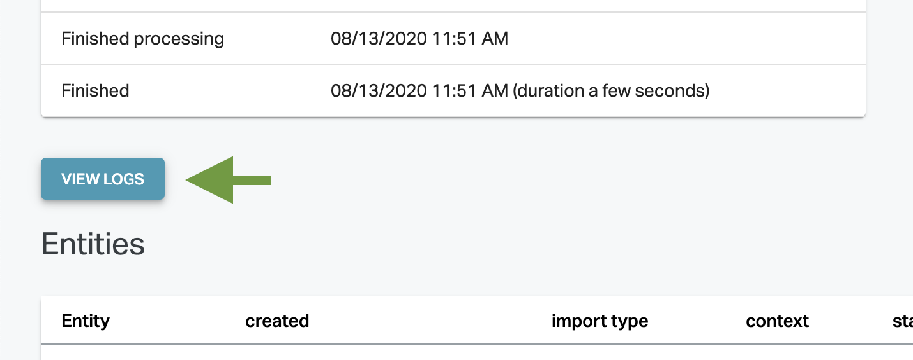

# Bulk file imports in CSV format via FTP or Shopgate Admin

## Introduction

This article covers how to upload catalog data as CSV into the Shopgate system including the file formats and how to check for errors.

**Note:** As this is a simplified format that does not support all features, it is only recommended for specific use cases or to get a quick start.

There are to way to insert new catalog data into the Shopgate system via CSV:

- drag and drop import in the Shopgate Admin
- ftp import

### Partial Import

All the imports done as CSV Uploads are partial imports. This means the set of entries in the CSV Files are treated as an update subset of the whole data at Shopgate. This means you need to specify which entities in retail red should be deleted and which entities should get added or updated.

JSON imports also support full import: you provide the full list of entities and the import process figures out which to delete.

## CSV Import Via Admin

The _Catalog_ > _Upload Data_ tab allows you to easily upload category, product, and inventory information.

Once you have properly formatted your CSV files, simply drag and drop each file into the appropriate box to upload your data. The data begins to process immediately and may take up to 15 minutes. Once the upload completes, details for the category, product, and inventory are available in their respective tabs.

You can specify the import strategy per file via the dropdown menu `import type`. Here you can choose between incremental (partial) and full import.

<!-- focus: center  -->



## CSV Import Via FTP

Before you're able to upload the CSV files over ftp, you need to get the address as well as the credentials. Both can be found in the Shopgate Admin in _Settings_ > _Imports_. Until stated otherwise in the Admin the address is:

```
Address: ftp.shopgate.io
Port: 21
Protocol: FTPS
```

On the same spot in the Admin you can find your credentials including the option to reset your password.

After connecting with the ftp server you will be presented with the following directory structure:

```
catalog
  default
    complete
    error
inventory
  complete
  error
```

To import a csv file you need to upload into a certain directory dedicated to the entity. For example:

- **Product** and **category** files need to be placed into **/catalog/default**
- The **inventory** file needs to be uploaded to the **/inventory** directory

After the upload the file will be processed. Is the processing done, you can find the file you uploaded in the complete subdirectory. In case of errors the error subdirectory will hold a file with the errors that occured during processing.

**Attention**: For the FTP import the files need to comply with the following convention:

- **\<products|categories>(\_fullimport)\_YYYYMMDD.csv**
- **inventory(\_fullimport(\_location\_\<locationCode>))\_YYYYMMDD.csv**

This convention allows you to specifify if it is a full or partial import (omitting \_fullimport will result in a patial import).

Examples:

- **products\_20200220.csv**<br>partial import of products
- **categories_fullimport\_20200220.csv**<br>full import of categories
- **inventory\_20200220.csv**<br>partial import of inventory
- **inventory_fullimport_location_loc1\_20200220.csv**<br>fullimport of inventories for location loc1

> **NOTE:** only inventory supports the location exclusive upload. Also specifying the location is only works with full imports.

## Formatting the CSV Files

You can upload the catalog data via a CSV file, using any inventory system. To prepare the CSV files to upload, you must follow the expected format. Click _Download CSV_ to view the sample CSV files that show you how to format your data. Field names are not case sensitive. If this is your first time uploading content, begin with the Category Upload and then proceed in order to the Product and Inventory uploads.

Note that each catalog entry contains the following field:

- `Import Type`: Indicates if record (row) is an "Add / Change” or "Delete." A value of "AC" indicates that the record should be added if it is not already present or updated if it is already present. A value of "D" indicates that the record should be deleted from the system. If you do not provide a value for this field, the import type will default to “AC.”

### Category CSV

The Category CSV establishes the framework for uploading products and inventory. These categories are required to create a product taxonomy so customers can browse the catalog. Most ecommerce and POS systems have an existing taxonomy you can export.

[English Example](https://data.shopgate.com/example_files/category_example.csv), [German Example](https://data.shopgate.com/example_files/category_example_de.csv)

| FieldName           | Required | Type        | Default Value | Description                                                                                                                                    |
| ------------------- | -------- | ----------- | ------------- | ---------------------------------------------------------------------------------------------------------------------------------------------- |
| ImportType          | Optional | Enum(AC,D)  | AC            | See `importType` in [Formatting the CSV Files](#formatting-the-csv-files). <br><br>**Example: AC**                                             |
| CategoryCode        | Required | String(255) |               | Primary key or record identifier for a product category.<br> <br>**Example: jeans**                                                            |
| Name                | Required | String(255) |               | User friendly name of a product category. <br><br>**Example: Jeans**                                                                           |
| SequenceId          | Optional | Integer     |               | The order that the categories will be displayed. If no value is present the order in the import file will be used. <br><br>**Example: 1**      |
| ParentCategoryCode  | Optional | String(255) |               | Code of the parent category code for hierarchy creation. If no value is present this category will not be nested. <br><br>**Example: clothes** |
| Image               | Optional | String(255) |               | URL to a category image <br><br>**Example: <http://some.url>**                                                                                 |
| CategoryDescription | Optional | String(255) |               | Short description of a product category. <br><br>**Example: This category contains jeans**                                                     |

### Product CSV

The Product CSV provides key information about each product. Each row represents a product record. Every product variant requires its own record entry. Configurable products can have up to three options (e.g. size, material, color).

[English Example](https://data.shopgate.com/example_files/product_example.csv), [German Example](https://data.shopgate.com/example_files/product_example_de.csv)

| FieldName           | Required | Type                                   | Default Value              | Description                                                                                                                                                                                                                                                                                                                                                                                                                                                                                                                                                                                                                                                |    |
| ------------------- | -------- | -------------------------------------- | -------------------------- | ---------------------------------------------------------------------------------------------------------------------------------------------------------------------------------------------------------------------------------------------------------------------------------------------------------------------------------------------------------------------------------------------------------------------------------------------------------------------------------------------------------------------------------------------------------------------------------------------------------------------------------------------------------- | -- |
| ImportType          | Optional | Enum(AC, D)                            | AC                         | See `importType` in [Formatting the CSV Files](#formatting-the-csv-files)<br><br>**Example: AC**                                                                                                                                                                                                                                                                                                                                                                                                                                                                                                                                                           | AC |
| ProductCode         | Required | String(255)                            |                            | Primary key or record identifier for a sales item<br><br>**Example: jeans**                                                                                                                                                                                                                                                                                                                                                                                                                                                                                                                                                                                |    |
| Sequence            | Optional | Integer                                |                            | Product rank sort order. A number 1 to n. If no value is present the order in the import file will be used.<br><br>**Example: 1**                                                                                                                                                                                                                                                                                                                                                                                                                                                                                                                          |    |
| LocaleCode          | Optional | String(5)                              | <merchant default setting> | Locale code for the catalog / item record. By default this will be set to the default locale code on the merchant account.<br><br>**Example: en-us**                                                                                                                                                                                                                                                                                                                                                                                                                                                                                                       |    |
| CurrencyCode        | Optional | String(3)                              | <merchant default setting> | Currency code for the catalog / item record. By default this will be set to the default currency on the merchant account.<br><br>**Example: USD**                                                                                                                                                                                                                                                                                                                                                                                                                                                                                                          |    |
| Name                | Required | String(255)                            |                            | Item name. User friendly product name that is displayed / used in the category list, product detail, cart, order, order confirmation, order summary, and in some notificiations.<br><br>**Example: The Jeans.**                                                                                                                                                                                                                                                                                                                                                                                                                                            |    |
| ShortDescription    | Optional | String(500)                            |                            | Optional quick description of a product. User friendly product short description that is normally displayed on the category list page and on the product detail page.<br><br>**Example: This is The Jeans.**                                                                                                                                                                                                                                                                                                                                                                                                                                               |    |
| LongDescription     | Optional | String(65535)                          |                            | Optional long "detailed" decription of a product. User friendly product long description that is normally displayed on the product detail page.<br><br>**Example: This is The Jeans. Just long.**                                                                                                                                                                                                                                                                                                                                                                                                                                                          |    |
| Url                 | Optional | String(255)                            |                            | Optional deep link to the product.<br><br>**Example: <http://some.url>**                                                                                                                                                                                                                                                                                                                                                                                                                                                                                                                                                                                   |    |
| ProductImages       | Optional | String(255)                            |                            | Optional, but recommended, link to a product image URL that will be used in category lists and on the PDP. A list of multiple URLs can be provided. URLs delimited by a tilde ~<br><br>**Example: <http://some.url1~http://some.url2>**                                                                                                                                                                                                                                                                                                                                                                                                                    |    |
| Sku                 | Optional | String(255)                            |                            | Item Stock Keeping Unit Code. If no value is present the record will be defaulted to the ProductCode value<br><br>**Example: JEA-BB-PUR-06**                                                                                                                                                                                                                                                                                                                                                                                                                                                                                                               |    |
| Upc                 | Optional | String(255)                            |                            | Optional field that enables additional search options for this product that is generally set to BARCODE or UPC value of the product<br><br>**Example: 03600029145**                                                                                                                                                                                                                                                                                                                                                                                                                                                                                        |    |
| MfgPartNum          | Optional | String(255)                            |                            | Optional field that enables additional search options for this product<br><br>**Example: 100-440-0.750-3434-A**                                                                                                                                                                                                                                                                                                                                                                                                                                                                                                                                            |    |
| ItemPrice           | Required | Decimal(8,2)                           |                            | Item price per quantity ordered<br><br>**Example: 99.95**                                                                                                                                                                                                                                                                                                                                                                                                                                                                                                                                                                                                  |    |
| Status              | Optional | Enum(active, inactive)                 | active                     | If no value is present the record will be defaulted to "Active"<br><br>**Example: Active**                                                                                                                                                                                                                                                                                                                                                                                                                                                                                                                                                                 |    |
| Saleprice           | Optional | Decimal(8,2)                           |                            | Item price value for items on sale, will be displayed a strike through price normally<br><br>**Example: 98.95**                                                                                                                                                                                                                                                                                                                                                                                                                                                                                                                                            |    |
| ItemUnitOfMeasure   | Optional | String(10)                             | each                       | Default unit of measure for a product. For example "each", "kg", "lb", "cm" etc.<br><br>**Example: kg**                                                                                                                                                                                                                                                                                                                                                                                                                                                                                                                                                    |    |
| UnitValue           | Optional | Decimal(8,2)                           | 1                          | Amount that the product contains of the unit specified above.<br><br>**Example: 250**                                                                                                                                                                                                                                                                                                                                                                                                                                                                                                                                                                      |    |
| UnitPriceRefUom     | Optional | String(10)                             |                            | Unit used for displaying the unit price information, see Displaying Unit Price Information<br><br>**Example: g**                                                                                                                                                                                                                                                                                                                                                                                                                                                                                                                                           |    |
| UnitPriceRefValue   | Optional | Decimal(8,2)                           |                            | Amount for displaying the Unit Price Information<br><br>**Example: 100**                                                                                                                                                                                                                                                                                                                                                                                                                                                                                                                                                                                   |    |
| HasCatchWeight      | Optional | Boolean                                | false                      | Determines if product is treated as Catch Weight product<br><br>**Example: false**                                                                                                                                                                                                                                                                                                                                                                                                                                                                                                                                                                         |    |
| ModelType           | Required | Enum(Standard, Configurable, Variant)  |                            | Sets the "model" or type of a product record<br><br>**Example: standard**                                                                                                                                                                                                                                                                                                                                                                                                                                                                                                                                                                                  |    |
| InventoryManaged    | Optional | Boolean                                | false                      | Inventory management setting for this product. Denotes if inventory is tracked / managed for a product record<br><br>**Example: true**                                                                                                                                                                                                                                                                                                                                                                                                                                                                                                                     |    |
| InventoryTreatment  | Optional | Enum(hideInStorefront, showOutOfStock) | showOutOfStock             | Allows you to set  the how the product should be displayed when out of stock.<br><br>**Example: hideInStorefront**                                                                                                                                                                                                                                                                                                                                                                                                                                                                                                                                         |    |
| ParentProductCode   | Optional | String(255)                            |                            | Parent Product Code for variant product records. If the record is a type of Variant, then this field is required and must reference the "Parent Product Code" that will enable the configuration of this product<br><br>**Example: parentJeans**                                                                                                                                                                                                                                                                                                                                                                                                           |    |
| TaxClass            | Optional | String(255)                            | <merchant default setting> | Product specific tax class. If no value is provided, the configurated default product tax class will be used. Tax classes are set up in the Admin under Settings > Taxes<br><br>**Example: germanStandardTax**                                                                                                                                                                                                                                                                                                                                                                                                                                             |    |
| FulfillmentMethods  | Required | Enum(directShip, BOPIS, ROPIS)         | BOPIS                      | A list of supported / enabled fulfillment methods for this product<br><br>**Example: ROPIS**                                                                                                                                                                                                                                                                                                                                                                                                                                                                                                                                                               |    |
| Properties          | Optional | String(255):String(255)                |                            | A list of key value pairs for product properties that can be used to provide additional information on product specs or properies to help shoppers find additional product details. These are displayed on the product detail page. Name / Value pairs on a single product can currently have any number of unique properties. They are formatted as follows in the properties field: DisplayedAttributeName:DisplayedAttributeValue Ie: Department:Grocery. To send more than one property per product each name/value pair should be seperated with a value sub-delimiter which is set to "~~"<br><br>**Example: Department:Grocery~~Size:24 16oz Cans** |    |
| Categories          | Required | String(255)                            |                            | List of category names that the product should be listed in. Name of the categories that the product should be listed in. Categories listed in this field will be created. Must be tilde delimited<br><br>**Example: Clothes~~Trousers~~Jeans**                                                                                                                                                                                                                                                                                                                                                                                                            |    |
| CategoryCode        | Required | String(255)                            |                            | Codes of the categories (must match existing categories) that the product should be listed in. If both this and Categories field are present on the record this one will be used and the Categories field will be ignored. Must be tilde delimited.<br><br>**Example: jeans~clothes**                                                                                                                                                                                                                                                                                                                                                                      |    |
| ProductOption1      | Optional | String(255)                            |                            | First configurable option for a "configurable" product or the first set value for a product "variant". The product option fields (1-3) and their value fields, along with the ParentProductCode field are used for "configurable products" or "Parent/Child Products" Ie: T-Shirt that comes in Small, Medium, or Large."<br><br>**Example: Size**                                                                                                                                                                                                                                                                                                         |    |
| ProductOption1Value | Optional | String(255)                            |                            | configurable product: List of possible values of variant configurations: Variant: Single value of variant record<br><br>**Example: configurable product: Small~~Medium~~Large, variant: Small**                                                                                                                                                                                                                                                                                                                                                                                                                                                            |    |
| ProductOption2      | Optional | String(255)                            |                            | Second configurable option for a "configurable" product or the first set value for a product "variant"<br><br>**Example: Size**                                                                                                                                                                                                                                                                                                                                                                                                                                                                                                                            |    |
| ProductOption2Value | Optional | String(255)                            |                            | configurable product: List of possible values of variant configurations: Variant: Single value of variant record<br><br>**Example: configurable product: Small~~Medium~~Large, variant: Small**                                                                                                                                                                                                                                                                                                                                                                                                                                                            |    |
| ProductOption3      | Optional | String(255)                            |                            | Third configurable option for a "configurable" product or the first set value for a product "variant"<br><br>**Example: Size**                                                                                                                                                                                                                                                                                                                                                                                                                                                                                                                             |    |
| ProductOption3Value | Optional | String(255)                            |                            | configurable product: List of possible values of variant configurations: Variant: Single value of variant record<br><br>**Example: configurable product: Small~~Medium~~Large, variant: Small**                                                                                                                                                                                                                                                                                                                                                                                                                                                            |    |

### Inventory CSV

[Example](https://data.shopgate.com/example_files/inventory_example.csv)

| FieldName    | Required | Type        | Default Value | Description                                                                                                                                                                                                                                                      |
| ------------ | -------- | ----------- | ------------- | ---------------------------------------------------------------------------------------------------------------------------------------------------------------------------------------------------------------------------------------------------------------- |
| ImportType   | Optional | Enum(AC, D) | AC            | See `importType` in [Formatting the CSV Files](#formatting-the-csv-files)<br><br>**Example: AC**                                                                                                                                                                 |
| ProductCode  | Required | String(255) |               | Primary key or record identifier for a sales item. In many cases product code and SKU are the same for merchants, however they can be different. The product code acts as the primary key in the Shopgate system for a sales item.<br><br>**Example: MTH-001** |
| Sku          | Optional | String(255) |               | Item Stock Keeping Unit Code. If no value is present the record will be defaulted to the ProductCode value<br><br>**Example: 03600029145**                                                                                                                       |
| LocationCode | Required | String(36)  |               | Indicates the location code for this inventory record. Must match existing setup location code.<br><br>**Example: loc1**                                                                                                                                         |
| OnHand       | Required | Integer     |               | The numeric on hand count of this item at this location. Must be a whole number<br><br>**Example: 10**                                                                                                                                                           |
| SafetyStock  | Optional | Integer     |               | The quatity of inventory that you would like to no be availble for digital orders, thus reserving them for Walk-ins. Must be a whole number.<br><br>**Example: 5**                                                                                               |
| Bin          | Optional | String(50)  |               | Aisle, Row, Shelve Location for where this item is locationed in the store<br><br>**Example: 45-12**                                                                                                                                                             |
| BinLocation  | Optional | String(50)  |               | Shelve location for this item in this location<br><br>**Example: 123**                                                                                                                                                                                           |

## Download Catalog Data

When you click on a "Download" link under category or products, you will trigger a new export to be created. The export can take several minutes to complete depending on the size of the catalog, however once complete you will receive an email with a link to download the file. This will be in the same file used for uploading CSV into the Shopgate platform.

## Check Processed Import

Sometimes the CSV file content is not consistent, maybe entities relationships can't be resolved and the import produces errors. For those kind of issues you can check the metrics of the import that has been processed.

In order to check the import logs navigate to _Settings > Imports_ and click on the import in the import list. On the detail view you can find the review logs button. **Note:** Logs for an import are only visible for 14 Days.

<!-- focus: center  -->


