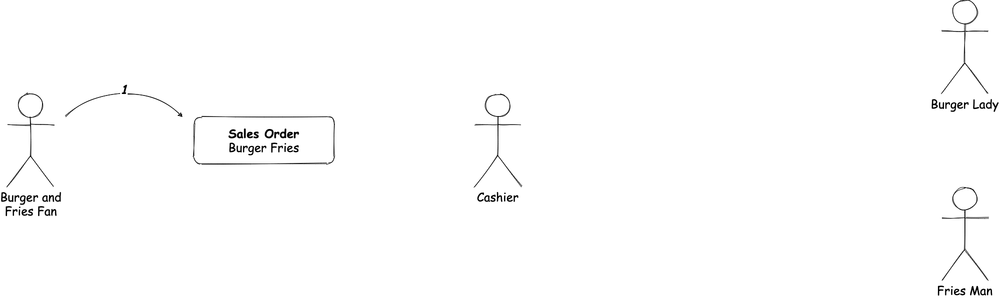
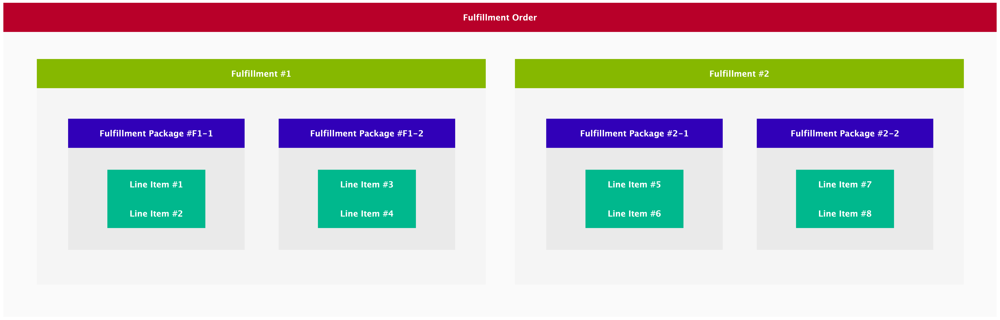
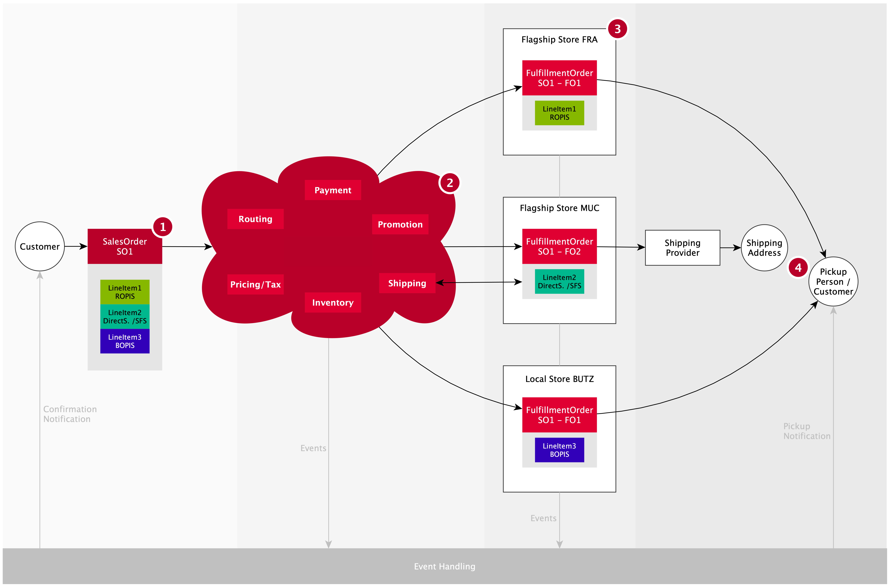

# Overview

## Content

1. [About this guide](#about-this-document)
2. [Concepts and Entities](#concepts-and-entities)
   1. [Fulfillment Methods](#fulfillment-methods)
   2. [Order Entities](#order-entities)
      1. [Sales Order](#sales-order)
      2. [Fulfillment Order](#fulfillment-order)
3. [Order Flow](#order-flow)
4. [Order Processing](#order-processing)
5. [Hooking into external Order Processing and Fulfillment](#hooking-into-external-order-processing-and-fulfillment)

## About this Document

This document gives you a highlevel overview of the order flow. It describes how an order gets created up to the point, the ordered line items reach the customer.

## Concepts and Entities

Before the Order Flow can be introduced it is important to understand certain entities retail.red uses to describe states and processes within the flow. These are the Order Entities and the Fulfillment Methods.

### Fulfillment Methods

Fulfillment methods describe certain ways to handle orders and their fulfillment. Currently retail.red supports three major Fulfillment Methods:

- **BOPIS:** **B**uy **O**nline **P**ick up **I**n **S**tore
- **ROPIS:** **R**eserve **O**nline **P**ick up **I**n **S**tore
- **DirectShip:** This method is available in two modes:
  - Handling by merchant
  - Handling by retail.red including Payment

All of these fulfillment types have different flows. For example **ROPIS**/**BOPIS** do not support shipping and **ROPIS** alone does not have payment included in the flow.

### Order Entities

retail.red has two major entities when it comes to orders which are:

- the [Sales Order](#sales-order) (SO) and
- the [Fulfillment Order](#fulfillment-order) (FO).

Both describe different information packages used along the order flow. While the Sales Order is the **customers view, agreement and description** of an order, the Fulfillment Order is derived from the Sales Order and **tells the Merchant and its worker how to fulfill** the order. A Sales Order can create multiple Fulfillment Orders.

The following fast food restaurant example describes how both entities work together:

1. The customer orders a burger with fries (**Sales Order**).
2. The cashier takes the order and routes a part of it (**Fulfillment Order**: burger) to the burger lady and another part (**Fulfillment Order**: fries) to the fries man.
3. Both fulfill their given orders and provide burger and fries to the cashier.
4. The cashier can now fulfill the customers order (**Sales Order**) by providing both burger and fries.

<!--  inline: true -->

#### Sales Order

The Sales Order is the customer agreement to buy items. It is what taxing, pricing, payment, ... is handled for. The SO gets created typically by customers transitioning a cart entity into an order on checkout. Creating a Sales Order marks the start of the retail.red order process.

The SO is also the customers view onto the order process. It gets updated over the timespan of the complete order process from creation to the complete fulfillment including pickup or delivery.

The Sales Order itself holds various kinds of information:

- Collection of line items
- Addresses associated with the order (shipping / billing)
- Price / tax information
- Payment information
- Fulfillment (general status (open, in progress, fulfilled), state of single fulfillments)
- Customer reference
- Promotions

Sales Orders have a defined lifecycle described by its states.

| State      | Description                                                                                                                                                                                                                                              |
| ---------- | -------------------------------------------------------------------------------------------------------------------------------------------------------------------------------------------------------------------------------------------------------- |
| draft      | Temporary state when order is created, but not yet placed. As soon as the customer enters the checkout at retail.red, an order is created with status draft. Once the customer has finished the checkout process, the order status is updated to "open". |
| open       | Order is placed, valid and waiting to be processed.                                                                                                                                                                                                      |
| inProgress | Order is being prepared (e.g. during picking/packing in progress).                                                                                                                                                                                       |
| ready      | Only for pickup in store orders: All line items of the order are ready to be picked up by the customer.                                                                                                                                                  |
| fulfilled  | Order has been fulfilled (e.g. shipment has been delivered or customer picked up the order), but payment is not yet completed.                                                                                                                           |
| completed  | Order is completed, including payment (payment has been captured).                                                                                                                                                                                       |
| rejected   | Order has been rejected by the merchant.                                                                                                                                                                                                                 |
| canceled   | Order has been canceled by the customer.                                                                                                                                                                                                                 |

#### Fulfillment Order

Fulfillment Orders get created while processing the Sales Order. FOs are essencially groupings of line items by **location** and **[Fulfillment Method](#fulfillment-methods)**. In the [Order Flow](#order-flow) you can see three FOs:

- Location: **Flagship Store FRA** Fulfillment Method: **ROPIS** **LineItem1**
- Location: **Flagship Store MUC** Fulfillment Method: **DirectShip** **LineItem2**
- Location: **Local Store BUTZ** Fulfillment Method: **BOPIS** **LineItem3**

Each will be handled in a different location with a different fulfillment flow determined by the Fulfillment Method.

FOs contain all the necessary information a location needs to fulfill the order like:

- FO Status
- LineItems
- Shipping Address (in case of DirectShip)
- Action Dates

Also the FOs have a Lifecycle described by states:

| State      | Description                                                              |
| ---------- | ------------------------------------------------------------------------ |
| requested  | The Fulfillment Order was created after the creation of the Sales Order. |
| accepted   | All line items have been accepted.                                       |
| inProgress | Transition state e.g. if line items are in different states.             |
| picked     | All line items have been picked.                                         |
| packed     | Line items have all been packed into packages.                           |
| ready      | Fulfillment Order is ready to be picked up.                              |
| hold       | Fulfillment gets paused manually for later processing.                   |
| checkedIn  | Manually set by merchant side when customer enters a location.           |
| canceled   | Fulfillment Order has been canceled by customer.                         |
| rejected   | Fulfillment Order has been rejected from merchant side.                  |
| fulfilled  | Fulfillment Order has been fulfilled.                                    |

##### Fulfillment Order Line Items

Fulfillment Order line items are the smallest part of a FO. FO line items can be grouped into Fulfillment Order packages during the fulfillment process. Fulfillment Order packages themselves can be grouped by fulfillments.

<!--  inline: true -->

All of those grouping entities have states that will be impicitly set during state transition of the line items. E.g. if all line items are set to fulfilled, all packages, all fulfillments and the Fulfillment Order is/are fulfilled.

## Order Flow

Generally the basic order flow consists of four stages. In the first stage (1) the customer creates an order in retail.red by turning a cart into the order during checkout. This order is a [Sales Order](#sales-order). The second stage (2) is the internal processing of the order by the retail.red order platform. The order gets split and routed to fitting locations in the third stage (3, fulfillment) as [Fulfillment Order(s)](#fulfillment-order). In the last stage (4) all parts of the order get deliverd or picked up.

<!--  inline: true -->

> **NOTE:** this is an overview for a basic highlevel order without all the subflows and details. More complex order flows are also possible.

During the flow all relevant actions can emit events that can be reacted upon. For example a notification can be send out to a customers device when an order is ready, or a [webhook can be triggerd](#hooking-into-ecp-order-processing-and-fulfillment) when the a Fulfillment Order reaches a location.

## Order Processing

After creation of a Sales Order several checks will be performed internally like

- Availability of inventory
- Reservation of inventory
- If needed: check if the selected fulfillment slot is available
- If BOPIS / DirectShip check payment information (including tax and promotions) and authorize payment

On changes of the order relevant parts will be reevaluated. For example pricing, tax, promotions or payment will be recalculated when fulfillment line items change.

After all these initial checks have been performed, the routing of the order will be processed. Routing an order means finding a location that can fulfill the order for the selected Fulfillment Method. Technically this process creates Fulfillment Orders for the Sales Order per location and Fulfillment Method.

<!--

### Order Splitting

One reason why a Sales Order can create multiple Fulfillment Orders is, that maybe one location can't fulfille the complete order. In this case the SO gets split into multiple FOs for fulfillment.

Another reason can be, that line items have different Fulfillment Methods. If some LIs have direct ship and other ROPIS, different locations can fulfill these orders.

-->

## Order Fulfillment

The fulfillment process is dependent of the FOs Fulfillment Method.

For all processes the line items of the FO need to be picked from the inventory. BOPIS and DirectShip differ ROPIS in terms of payment handling and shipping provider handling (label printing, actual shipping, ...).

## Hooking into external Order Processing and Fulfillment

It is possible to hook into various actions during the order process. This can be done in two ways:

- by calling the [retail.red API](/api-reference) from an external system or

- by hooking into events emitted by the retail.red order process like `salesOrderAdded`, `fulfillmentOrderUpdated`, and `schedulePickupReminderTimeReached`. For a complete list of supported events see [Webhook Events](/guides/integrations/webhook-integration/available-webhooks). To learn how to work with the retail.red webhooks see [Webhook Integration Guide](/guides/integrations/webhook-integration/overview)
