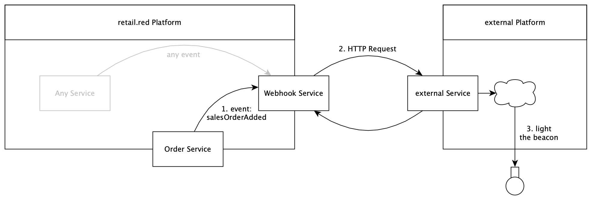

# Overview

## Content

1. [About this guide](#about-this-guide)
2. [Introduction](#introduction)
3. [Setup a Webhook](#setup-a-webhook)
4. [The Incoming Request](#the-incoming-request)
5. [Retry Mechanism](#retry-mechanism)

## About this guide

This guide covers the webhook feature of retail.red. It should deliver an overview what this feature is and how it works.

## Introduction

The webhook service can call an external HTTP route upon certain events that occur on the retail.red platform.

<!--  inline: true -->



**For example:** a merchant can receive a HTTP call to a configured endpoint when a fulfillment order was added. The endpoint could then process this call and light a shiny red rotating beacon in the relevant location along with sounding a deep horn.

Which event should result in an HTTP call to which endpoint is configurable via the Webhook Service API.

## Setup a Webhook

The setup of webhooks need to be done via the [retail.red webhook API](/docs/retail-red/YXBpOjM1NjU0NzY2-webhook).

1. [Create Webhook](/docs/retail-red/b3A6MzU2NTUxMjA-create-webhooks) with the relevant events to be sent to a given external endpoint.
2. [Test the Webhook](/docs/retail-red/b3A6MzU2NTUxMjM-test-webhook) by triggering it manually.

   **Be aware** that this call will only contain a sample payload which does not reflect the actual payload or its structure.

## The Incoming Request

### Identification Token

Every incoming request will contain an identification token (key: `shopgate-token`) in the request headers. This token can be used to verify, that the request originated from the retail.red webhook API. The Webhook service has a route to [get the webhook token](/docs/retail-red/b3A6MzU2NTUxMTg-get-webhook-token). The token is unique for a marchant.

### Allow List

In case an allow list is present at the external service the IP:

- `35.195.40.181` for production,
- `35.205.144.206` for staging

must be added.

### Body Structure

All requests will have the content type `application/json`. The request body looks like this:

```json
	"id": "34caaaf2-15b5-4aca-8f71-dfd0b287b116", //request identification
	"date": "2021-03-02T10:52:20.952Z",
	"webhookId": "f84ade20-46f3-4a30-b96f-834f7c411b5c", // identification of the webhook at the webhook service
	"webhookCode": "productCreatedMagento",
	"eventCode": "productCreated",
	"tenantId": "theMerchant#1",
	"tenantType": "merchant",
	"payload": {
		<payload depending on event>
	}
```

See [Available Events](./available-webhooks.md) for the specific payloads.

## Retry Mechanism

If a webhook request fails (does not response with proper `2xx`, `301`, `302`, `303`, `305`, `307` or `308` response), the webhook service tries to send the request again. But instead of doing this immediately the webhook service waits a progressing timespan between the retries. The row of timespans is: `60`, `180`, `300`, `600`, `900`, `1800`, `3600`, `7200`, `21600`, and `50400` seconds.

> **NOTE:** The response should be send within a timeframe of 10 seconds. Otherwise the request will be retried.
